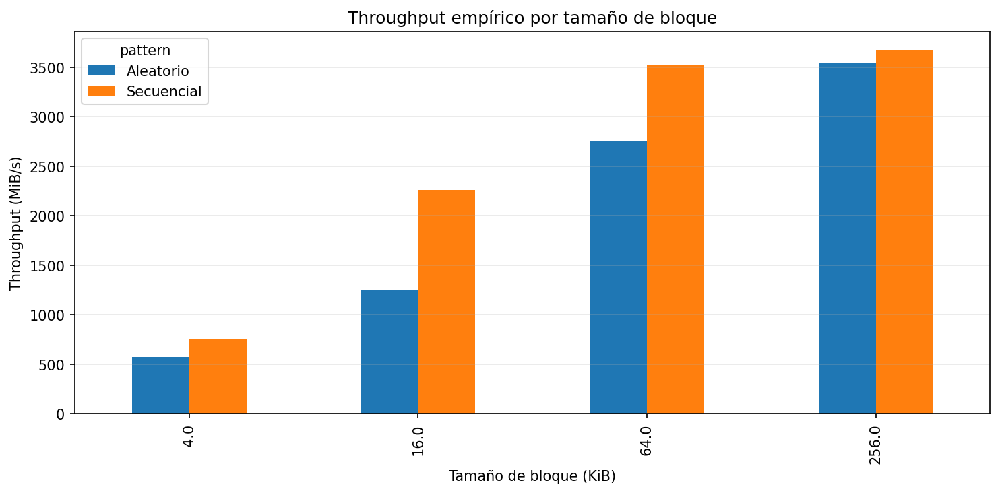
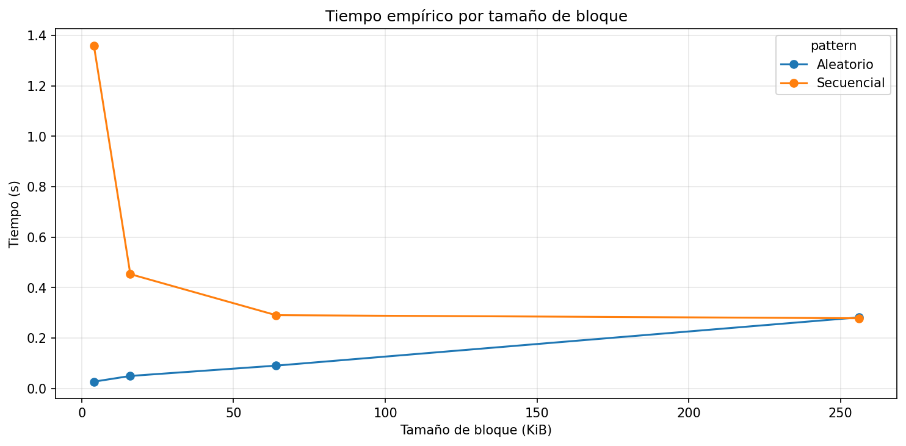
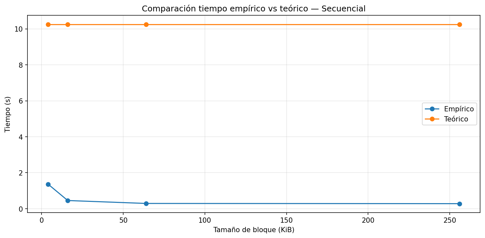
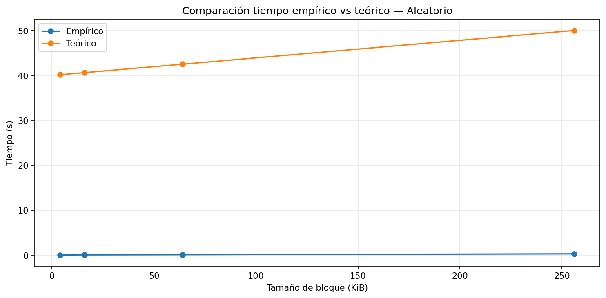
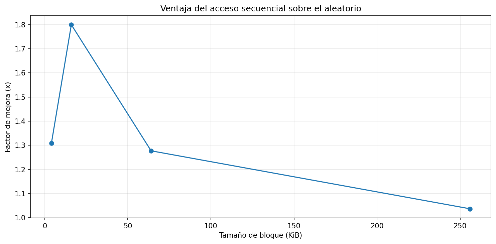

# lab3-IO_performance-SantiagoAcevedo
Repositorio con la solución del laboratorio 3 del curso Estructuras de Datos.

## Identificación de la Tecnología de Almacenamiento

El sistema cuenta con dos dispositivos de almacenamiento: un HDD y un SSD NVMe. Las pruebas se realizaron sobre el HDD debido a limitaciones de espacio en el SSD, por lo que los resultados corresponden a esa tecnología.

| Recurso                | Requerimiento           |
| ---------------------- | ----------------------- |
| Espacio libre en disco | **908 GB**              |
| Memoria RAM            | **8 GB**                |
| CPU                    | Intel Core i3           |
| Sistema operativo      | Windows 11              |

## Caracterización del Equipo
Estas son algunas de las características fundamentales del equipo que influirán en la interpretación del resultado.

| Parámetro | Valor Observado |
| --- | --- |
| **Sistema Operativo** | Windows 11 25H2 |
| **CPU (Modelo y Frecuencia)** | Intel Core i3-10110U @ 2.10GHz |
| **Arquitectura y Núcleos** | x64 / 2 núcleos físicos |
| **Memoria RAM Total** | 8 GB DDR4 |
| **Tecnología de Almacenamiento** | HDD SATA |
| **Carga de CPU en Reposo (%)** | ~8.5% |

## Punto de control 1 — Revisión conceptual

1. ¿Qué representa la latencia en este laboratorio?
2. ¿Qué representa el throughput?
3. ¿Por qué en acceso secuencial normalmente se asume que $M \approx 1$?
4. ¿Por qué en acceso aleatorio $M$ tiende a ser mayor?

### Respuestas

- Respuesta 1: La latencia representa el tiempo que tardan los datos en ser transportados, osea, cuando se buscan y justo salen de su origen hasta que llegan a su destino final.
- Respuesta 2: El throughput representa que tantos datos se pueden transportar por cada unidad de tiempo.
- Respuesta 3: Porque solo se accede a los datos una sola vez y a partir de ahí se busca sin saltarse nada, aunque pueda ocurrir que se revisen todos los datos antes de llegar al requerido.
- Respuesta 4: Porque aquí ya no revisa todo en orden sin saltarse nada, sino que realiza saltos entre distintos lugares del disco, y cada salto aumente la $M$.

## Punto de control 2 — Reflexión sobre la configuración

1. **Tamaño del archivo:** ¿Es suficiente para superar la caché RAM de su equipo? Compare con los valores de RAM registrados en la Etapa 1 de la guía.

2. **Tamaño de bloque:** Los tamaños evaluados (4 KB, 16 KB, 64 KB, 256 KB) corresponden a tamaños típicos de páginas en sistemas operativos y motores de bases de datos. ¿Cuál esperaría que tuviera mejor rendimiento en acceso aleatorio y por qué?

3. **Entorno de ejecución:** ¿Está ejecutando en local o en Google Colab? Recuerde que en Colab los tiempos medidos corresponden al hardware de Google, no al suyo.

### Respuestas

- Respuesta 1: El archivo tiene 1 GB, y ya que mi computador tiene 8 GB de RAM, el archivo todavía cabe en la memoria, pero es bastante grande como para que no toda la lectura se haga directamente ahí, entonces si se podrá ver como funciona el HDD.
- Respuesta 2: Los bloques más pequeños, como 4 KB, tardan más en las lecturas aleatorias porque el disco tiene que moverse muchas veces para leer cada pedacito. Creo que los bloques más grandes, como los de 64 KB o 256 KB, deberían ir más rápido porque cada movimiento del disco lee más datos y se pierde menos tiempo.
- Respuesta 3: Lo estoy ejecutando en el local, entonces los tiempos medidos si corresponden al hardware de mi computador.

## Creación y análisis del archivo de prueba

Después de crear el archivo, responda:

1. ¿Qué papel cumple este archivo dentro del experimento?
2. ¿Por qué es útil trabajar con un archivo relativamente grande?
3. ¿Qué cree que ocurriría si el archivo fuera demasiado pequeño?

### Respuestas

- Respuesta 1: Este archivo cumple el papel de poner a prueba el rendimiento del disco HDD, ya que al tener un tamaño tan grande nos permitirá explorar el comportamiento del disco en disntas situaciones.
- Respuesta 2: Porque este archivo, al ser bastante grande en comparación con los archivos que se manejan en la memoria RAM, obliga a que no sea ahi sino en el disco HDD en donde se procese.
- Respuesta 3: Si el archivo fuera demasiado pequeño, seria procesado por el caché del sistema operativo, el cual trabaja a una velocidad demasiado superior al del disco HDD, por lo que no podríamos analizar verdaderamente el rendimiento I/O del sistema.

## Análisis de resultados empíricos

Observe la tabla generada y responda:

1. ¿Cuál patrón de acceso fue más rápido para cada tamaño de bloque?
2. ¿El throughput cambió al aumentar el tamaño de bloque?
3. ¿En qué caso observó la mayor diferencia entre secuencial y aleatorio?

> **Criterio mínimo:** la respuesta 3 debe incluir valores numéricos concretos obtenidos de la tabla (throughput en MiB/s o tiempo en s).

### Respuestas
- Respuesta 1: Para los 3 bloques más pequeños, que eran de 4 KB, 16 KB y 64 KB, la lectura aleatoria fue más rápida. Para el bloque más grande, el de 256 KB, el tiempo que tardó la lectura secuencial fue muy similar a la aleatoria, así que ambos patrones rinden parecido.
- Respuesta 2: Sí, el throughput aumentó mucho a medida que el tamaño de bloque crecía. Los bloques pequeños leen menos datos por cada operación, por lo que tardan más, pero los bloques grandes aprovechan mejor el disco y el throughput se eleva de la misma forma.
- Respuesta 3: La mayor diferencia entre secuencial y aleatorio en cuestiones de tiempo fue en la prueba con el bloque de 4 KB, pues con el acceso secuencial tardó 1.3592 segundos, mientras que con el aleatorio solo tardó 0.0271 segundos.
En cuanto a throughput, la diferencia más grande estuvo en el caso del bloque de 16 KB, pues el throughput del acceso secuencial fue de 2258.78 MiB/s, mientras que el aleatorio fue de 1255.34 MiB/s. Esto muestra que, en este caso específico, el acceso secuencial fue mucho más eficiente en términos de throughput, aunque su tiempo de ejecución también fue mayor que el del acceso aleatorio.

## Punto de control 3 — Modelo teórico elegido

Indique cuál dispositivo teórico usó para comparar sus resultados:

- Dispositivo modelado: HDD aproximado.
- Latencia asumida: 10ms
- Throughput asumido: 100MB/s

Este modelo es muy similar a mi entorno real, ya que estoy ejecutando estas pruebas en el disco HDD de mi computador, el cual debería tener una latencia y un throughput aproximadamente iguales a los del modelo teórico.

## Análisis comparativo: teoría vs práctica

Interprete la tabla comparativa:

1. ¿Los tiempos empíricos son mayores o menores que los teóricos?
2. ¿En cuál patrón de acceso la teoría se aproxima mejor?
3. ¿Qué factores reales podrían explicar las diferencias?

### Respuesta

Comparando los resultados empíricos con los teóricos, se observa que los tiempos medidos en la práctica fueron mucho menores que los estimados por el modelo teórico. Esto indica que el sistema tuvo un mucho mejor desempeño que el esperado, especialmente en los accesos aleatorios, donde la diferencia fue todavía más grande que en los secuenciales.

El patrón en el que la teoría se aproxima más a la práctica sigue siendo el acceso secuencial, especialmente en el bloque de 4 KB, aunque la diferencia continúa siendo bastante notable. En este caso, el tiempo empírico fue de 1.3592 s, mientras que el teórico fue de 10.25 s. En los accesos aleatorios, el modelo teórico se aleja muchísimo más de los valores reales obtenidos, especialmente en bloques pequeños, donde los tiempos reales fueron muchísimo mas bajos que los teóricos.

Estas diferencias se pueden explicar principalmente por la caché del sistema operativo, es decir, el uso de la memoria RAM. Esta influyó bastante, ya que el tamaño del archivo creado es menor que la memoria disponible, lo que hace que muchas lecturas se realicen desde la memoria y no directamente desde el disco, aumentando así la velocidad en los procesos. Además, es posible que la carga del sistema, al ser baja, también brinde más velocidad y afecte los resultados, haciendo que en la práctica todo sea más rápido de lo esperado teóricamente.

## Interpretación de gráficas

### Throughput

Describir con mis palabras qué muestra esta gráfica:

- ¿Qué barras son más altas?
- ¿Qué significa eso en términos de rendimiento?
- ¿Cuál patrón aprovecha mejor la lectura en bloques?

> **Criterio mínimo:** Mencionar al menos un tamaño de bloque específico y su valor de throughput observado.

#### Respuesta

La gráfica muestra cómo cambia el throughput al aumentar el tamaño de bloque tanto en el acceso secuencial como en el aleatorio. Vemos que las barras más altas corresponden a los bloques de mayor tamaño, especialmente los de 256 KB, donde el throughput alcanza aproximadamente 3677 MiB/s en secuencial y 3547 MiB/s en aleatorio.

Esto significa que el rendimiento mejora cuando se utilizan bloques más grandes, ya que el sistema puede transferir más datos en cada operación de lectura y de ese modo aprovecha mejor los recursos disponibles.

Además, se observa que el patrón secuencial tiene barras más altas que el aleatorio, especialmente en bloques pequeños y medianos. Por ejemplo, con bloques de 64 KB el throughput secuencial fue de aproximadamente 3522 MiB/s, mientras que el aleatorio fue de 2758 MiB/s. Esto indica que el acceso secuencial aprovecha mejor la lectura en bloques, ya que los datos se leen de manera continua y más eficiente.

### Tiempo

Explicar cómo cambia el tiempo total cuando cambia el tamaño de bloque.

> **Criterio mínimo:** compare el comportamiento de la curva secuencial con la aleatorio e indique en qué punto divergen más.

#### Respuesta

La gráfica muestra cómo cambia el tiempo total de lectura a medida que aumenta el tamaño de bloque en los accesos secuenciales y aleatorios. En el caso del acceso secuencial, el tiempo disminuye considerablemente al pasar de bloques pequeños a bloques más grandes, ya que se necesitan menos operaciones de lectura para recorrer la misma cantidad de datos. Por ejemplo, el tiempo pasa de aproximadamente 1.36 s con bloques de 4 KB a cerca de 0.28 s con bloques de 256 KB.

En el acceso aleatorio pasa algo distinto, y es que los tiempos comienzan siendo muy bajos en bloques pequeños y van aumentando poco a poco a medida que crece el tamaño del bloque, pasando de aproximadamente 0.03 s en 4 KB a cerca de 0.28 s en 256 KB.

La mayor diferencia entre ambas curvas se observa en el bloque de 4 KB, donde el acceso secuencial tarda aproximadamente 1.36 s, mientras que el aleatorio solo tarda cerca de 0.03 s. A medida que el tamaño del bloque aumenta, ambas curvas se acercan cada vez más, hasta volverse muy similares en el bloque de 256 KB.

### Comparación empírico vs teórico

Observar las curvas y responder:

1. ¿Las curvas tienen una tendencia similar?
2. ¿Dónde se separan más?
3. ¿Qué le sugiere eso sobre el modelo usado?

> **Criterio mínimo:** la respuesta 3 debe indicar si el modelo sobreestima o subestima el tiempo real, y proponer una razón.

#### Respuesta

Al comparar las curvas empíricas y teóricas, se observa que ambas mantienen una tendencia parecida en algunos casos, ya que muestran cambios graduales conforme aumenta el tamaño del bloque. Sin embargo, las diferencias entre ambas siguen siendo bastante grandes, especialmente en los accesos aleatorios, donde la curva teórica se mantiene muy por encima de la empírica.

La mayor separación entre las curvas ocurre principalmente en los bloques pequeños, especialmente en 4 KB. En el acceso secuencial, por ejemplo, el tiempo empírico fue de aproximadamente 1.36 s, mientras que el teórico se mantuvo alrededor de 10.25 s. En el acceso aleatorio la diferencia fue todavía más grande, ya que los tiempos teóricos estuvieron entre 40 y 50 segundos, mientras que los empíricos permanecieron muy cerca de 0 segundos en comparación.

Esto sugiere que el modelo utilizado sobreestima bastante el tiempo real de ejecución. Una posible razón es que el modelo teórico simplifica mucho el comportamiento real del sistema y no tiene en cuenta cosas como el uso de memoria RAM por parte del sistema operativo, lo que hace que muchas lecturas se hagan mucho más rápido de lo esperado.

### Ventaja del acceso secuencial

La gráfica muestra cuántas veces el acceso secuencial supera al aleatorio.

- ¿Cuál fue el mayor factor de mejora observado?
- ¿Cómo cambia esa ventaja con el tamaño de bloque?
- ¿Qué implicación tiene esto para el diseño de software?

> **Criterio mínimo:** incluya el valor numérico del mayor speedup observado y el tamaño de bloque en que ocurrió.

#### Respuesta

La gráfica muestra cuántas veces el acceso secuencial fue más eficiente que el acceso aleatorio para cada tamaño de bloque. El mayor factor de mejora observado fue de aproximadamente 1.8x y ocurrió en el bloque de 16 KB, lo que indica que en ese caso el acceso secuencial logró un throughput mucho mayor que el aleatorio.

También se observa que esta ventaja disminuye a medida que aumenta el tamaño de bloque. En los bloques pequeños y medianos la diferencia entre ambos patrones es más notable, mientras que en el bloque de 256 KB la mejora es apenas de aproximadamente 1.04x, por lo que ambos patrones terminan teniendo un rendimiento muy parecido.

Esto implica que, al diseñar software, suele ser más conveniente aprovechar accesos secuenciales y trabajar con bloques de datos más grandes, ya que eso permite mejorar el rendimiento y aprovechar mejor el sistema de almacenamiento.

## Conclusión final

Redactar una conclusión que responda, en prosa continua y con sus propias
palabras, las siguientes preguntas:

- ¿Cómo se almacena la información en disco y por qué eso importa?
- ¿Por qué el acceso secuencial y el aleatorio tienen desempeños tan distintos, incluso en un SSD?
- ¿Qué tan bien predijo el modelo teórico el comportamiento real de su equipo?
- ¿Qué decisión de diseño tomaría en un sistema real con base en lo que midió?

> **Criterio mínimo:** la conclusión debe incluir al menos un valor numérico concreto de sus resultados (por ejemplo, el factor de speedup o el throughput secuencial medido) y conectarlo con uno de los conceptos teóricos del curso.

### Conclusión

Con este laboratorio fue posible ver cómo la forma en la que se guardan y leen los datos en un disco afecta directamente el rendimiento. La información se almacena en bloques, por lo que el tamaño de estos y el tipo de acceso utilizado influyen bastante en el tiempo de lectura. En general, el acceso secuencial tuvo mejores resultados que el aleatorio, ya que los datos se leen de forma continua y más organizada. La mayor diferencia se observó en los bloques de 16 KB, donde el throughput secuencial fue de aproximadamente 2259 MiB/s, mientras que el aleatorio fue de cerca de 1255 MiB/s, mostrando una mejora de casi 1.8x.

También se observó que el throughput aumentaba bastante al usar bloques más grandes, llegando a valores cercanos a 3677 MiB/s en el acceso secuencial con bloques de 256 KB. Al comparar los resultados reales con los teóricos, se vio que el modelo teórico sobreestimaba mucho los tiempos reales, especialmente en el acceso aleatorio. Esto ocurrió principalmente porque muchas lecturas terminaron haciéndose desde la memoria RAM gracias a la caché del sistema operativo, haciendo que todo fuera más rápido de lo esperado. Con base en los resultados obtenidos, en un sistema real sería mejor intentar aprovechar accesos secuenciales y trabajar con bloques más grandes, ya que eso ayuda bastante a mejorar el rendimiento del almacenamiento.

## 11. Preguntas de cierre

Responda las siguientes preguntas apoyándose en los resultados del experimento.

1. **Comparación de patrones:** Con base en sus mediciones, ¿cuántas veces más rápido fue el acceso secuencial respecto al aleatorio en su equipo? ¿Ese resultado era el esperado según la teoría?

Con base en las mediciones obtenidas, el acceso secuencial llegó a ser aproximadamente 1.8 veces más rápido que el aleatorio, especialmente en el bloque de 16 KB. Este resultado sí era esperado según la teoría, ya que en el acceso secuencial los datos se leen de forma continua, mientras que en el aleatorio el sistema debe realizar más saltos entre distintas posiciones del disco, lo que normalmente reduce el rendimiento.

2. **Efecto del tamaño de bloque:** ¿Qué ocurrió con el throughput del acceso aleatorio a medida que aumentó el tamaño de bloque? ¿Por qué cree que sucede eso?

A medida que aumentó el tamaño de bloque, el throughput del acceso aleatorio también aumentó bastante. Por ejemplo, pasó de aproximadamente 576 MiB/s con bloques de 4 KB a cerca de 3547 MiB/s con bloques de 256 KB. Creo que esto sucede porque, al usar bloques más grandes, cada lectura obtiene más datos de una sola vez, por lo que se aprovecha mejor cada acceso realizado al disco.

3. **Teoría vs práctica:** Identifique un caso en sus resultados donde la medición empírica se alejó del modelo teórico. ¿A qué factor atribuye esa diferencia?

Uno de los casos donde la medición empírica más se alejó del modelo teórico fue en el acceso aleatorio con bloques de 4 KB. El modelo teórico estimaba un tiempo cercano a 40 segundos, mientras que el tiempo real fue de apenas aproximadamente 0.03 segundos. La principal razón de esta diferencia probablemente fue el uso de caché en memoria RAM por parte del sistema operativo, ya que muchas lecturas terminaron haciéndose desde memoria y no directamente desde el disco HDD.

4. **Tipo de disco:** Compare sus resultados con los valores de referencia de la tabla de la guía. ¿Su equipo se comportó como un HDD, un SSD SATA o un SSD NVMe?

Aunque las pruebas se realizaron sobre un HDD SATA, los resultados obtenidos se parecieron mucho más a los de un SSD rápido o incluso a un SSD NVMe, especialmente por los throughput tan altos observados, que llegaron hasta aproximadamente 3677 MiB/s. Sin embargo, esto ocurrió principalmente porque la memoria RAM influyó bastante en las mediciones, acelerando muchas lecturas mediante la caché del sistema operativo.

5. **Aplicación práctica:** Imagine que debe almacenar una tabla de estudiantes con 1 millón de registros. Con base en lo que midió ¿preferiría leerla toda de forma secuencial o acceder a registros individuales de forma aleatoria? ¿Por qué?

Si tuviera que trabajar con una tabla de estudiantes de 1 millón de registros, preferiría leerla de forma secuencial siempre que fuera posible. Con base en los resultados obtenidos, este tipo de acceso aprovecha mejor el rendimiento del sistema y alcanza throughput más altos. Además, leer los datos de forma continua reduce la cantidad de saltos y accesos separados que deben hacerse en el disco, haciendo que el proceso sea más eficiente.